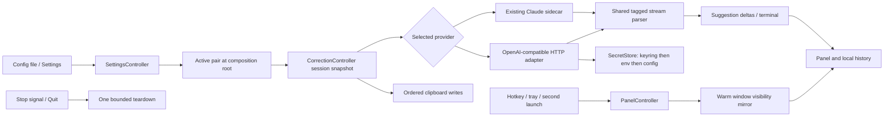

# Phase 02: Daemon Truth — Settings, Panel, Teardown, Provider & Spine — Research

**Researched:** 2026-09-24
**Domain:** Flutter Linux resident daemon; state, window reconciliation, lifecycle, OpenAI-compatible streaming
**Confidence:** MEDIUM — repository contracts and seams are inspected; both required live provider targets and a Wayland compositor are unavailable in this environment.

<user_constraints>
## User Constraints (from CONTEXT.md)

### Locked phase scope (verbatim)

**26 consolidated requirements are locked.** Read `.planning/phases/02-daemon-truth-settings-panel-teardown-provider-spine/02-SPEC.md` for their full behavior, boundaries and acceptance criteria before planning or implementing. The 26 requirements cover all 40 Phase 2 roadmap items; this document records only the choices left open by that spec.

**In scope (from 02-SPEC.md):**

- All 40 roadmap requirements for Phase 2, across Waves A–F, with no deferral.
- Wave A: SETTINGS-01…04, SETTINGS-06, SETTINGS-08, SETTINGS-09, CONFIG-01.
- Wave B: PANEL-01…PANEL-07.
- Wave C: PANEL-09…PANEL-15, PANEL-17, PANEL-19, SETTINGS-05, SETTINGS-07.
- Wave D: STARTUP-01…STARTUP-03, STARTUP-05.
- Wave E: PROVIDER-02, PROVIDER-03, including the `SecretStore` port and keyring → environment → config resolution chain.
- Wave F: ARCH-01, ARCH-03…ARCH-08, LEDGER-01, plus the Phase 1 AD-9 declaration hand-off.
- Close all 40 ledger entries append-only.

**Out of scope (from 02-SPEC.md):**

- Phase 1's remaining gap-closure plans 01-21…01-24; Phase 2 assumes Phase 1 closes first.
- A fifth `CorrectionFailureKind` member.
- New test, gate or CI work; existing tests must not break.
- Any history schema change.
- The parked history/SQLite data-safety cluster.
- New user-facing capabilities beyond PROVIDER-02.
- Non-Linux platforms, Electron and webview shells.
- Rewriting the frozen hexagonal architecture.

The phase spec's no-new-test boundary is more specific than the general test expectation in `AGENTS.md` §7. Planning must retain the phase boundary and keep the existing suite passing. The source product SPEC is regenerated by `/bmad-spec`, never hand-edited; Wave F's CAP-2 reconciliation must respect that rule.

### Locked implementation decisions (verbatim)

#### Panel size and placement

- **D-01:** On summon, the desired placement is the center of the display containing the pointer. If display geometry cannot be read, use the chosen default and let startup succeed, as the phase spec requires. The hotkey path still only toggles the warm window: research/planning must determine whether the pointer-display placement can be prepared while the panel is hidden. If it cannot be achieved without hotkey-path I/O or missing Wayland capabilities, surface that conflict rather than silently changing the placement rule.
- **D-02:** The normal desktop opening size is approximately **640 × 520 logical pixels**. The phase spec's shrink-to-fit rule applies on a smaller display. The exact minimum remains a planning choice constrained by simultaneous readability of original text and a correction.
- **D-03:** Keep the current roughly **40% editor / 60% suggestions** vertical split at the default size.

#### Copy and selection cues

- **D-04:** Show copy progress, success and failure on the affected suggestion card, adjacent to its Copy action. The card identifies which variant the status concerns.
- **D-05:** While a clipboard write is pending, show **both a spinner and “Copying…”** beside that card's button. Copy buttons remain usable so a later request can win. The phase spec's last-request-wins rule governs overlapping writes and feedback.
- **D-06:** After a completed write, show **“Copied”** on that card until the next copy request or correction. Do not show success for a failed or hung write.
- **D-07:** Mark the selected variant with **both a highlight and a check mark**. Clicking an already-selected card remains a no-op, and selection never copies.

#### Hotkey status in the tray

- **D-08:** For an unavailable shortcut, keep the tray's warning icon and show **one plain-language, cause-specific menu line** that also tells the user the panel is reachable through the tray. Place the line below **“Open the panel”**; that action remains enabled.
- **D-09:** If a requested rebind is refused but the previous shortcut still works, the icon continues to show availability. Mention the refusal in the menu **only while Settings shows that refusal**; clear that note when the Settings error clears. Do not portray the working old shortcut as unavailable.
- **D-10:** When an unavailable shortcut becomes available again, return immediately to the normal icon and remove the warning line. No restoration notice or desktop notification.

#### OpenAI-compatible provider and settings

- **D-11:** Use the **OpenAI API and local Ollama** as the two distinct compatibility targets required by the phase spec. The product still exposes one configurable OpenAI-compatible provider, not service-specific provider branches or a fallback chain.
- **D-12:** Show the **winning API-key source** in an always-visible line under the provider settings. Never display the key value. The source order remains keyring → environment → config as locked by the spec.
- **D-13:** When the config file is the winning key source, show a short **plaintext warning directly below** the source line. The daemon may read a hand-placed key from config but never writes one there.
- **D-14:** Provide explicit editable **Base URL** and **Model** fields in the OpenAI-compatible provider's Settings flow. The model remains part of a prompt-and-model `Preset`, as the provider contract requires; the UI must not create a provider-only model setting. Mark either empty field **“Required” immediately** and prevent saving that provider's in-app settings until both are filled. Unrelated Settings changes, including hotkey and preset selection, remain usable.
- **D-15:** The in-app save guard does not change the locked behavior for a hand-edited incomplete config: startup succeeds, and the first correction reports `providerUnavailable` with an actionable inline message. Provider failures stay within the existing four `CorrectionFailureKind` values.

#### Carry-forward decisions and planner discretion

- Phase 1 already chose accurate effective-binding reporting, three distinct unavailability causes, no desktop notifications, and no automatic reclaim after revocation. The tray decisions above extend that reporting to the tray without reopening those choices.
- The phase spec already decides card-click selection, last-request-wins copying, visible draft discard across settings view swaps, panel text preservation, secret lookup order, unknown provider behavior, stateless correction sessions, and the four-kind failure contract. Do not ask for or redesign those decisions during planning.
- The planner chooses the exact window minimum, layout-compatible copy-status implementation, and transport details while respecting the frozen source SPEC, provider contract, architecture spine, and the product decisions above. Research should test the OpenAI and Ollama streaming differences before fixing the adapter design.

### Deferred Ideas (OUT OF SCOPE, verbatim)

None — discussion stayed within Phase 2 scope.
</user_constraints>

<phase_requirements>
## Phase Requirements

The following **40 IDs are quoted verbatim** from the roadmap's Phase 2 requirement list: `SETTINGS-01, SETTINGS-02, SETTINGS-03, SETTINGS-04, SETTINGS-05, SETTINGS-06, SETTINGS-07, SETTINGS-08, SETTINGS-09, CONFIG-01, PANEL-01, PANEL-02, PANEL-03, PANEL-04, PANEL-05, PANEL-06, PANEL-07, PANEL-09, PANEL-10, PANEL-11, PANEL-12, PANEL-13, PANEL-14, PANEL-15, PANEL-17, PANEL-19, STARTUP-01, STARTUP-02, STARTUP-03, STARTUP-05, PROVIDER-02, PROVIDER-03, ARCH-01, ARCH-03, ARCH-04, ARCH-05, ARCH-06, ARCH-07, ARCH-08, LEDGER-01`. [VERIFIED: .planning/ROADMAP.md:188-208] The implementation support below maps every ID; its behavior text is grounded in the source requirement list. [VERIFIED: .planning/REQUIREMENTS.md:61-121]

| Wave | IDs | Planning support |
|---|---|---|
| A | SETTINGS-01 | Keep controller identity; atomically refresh active provider/preset for the next run and snapshot each in-flight run. |
| A | SETTINGS-02 | Persist the working prior binding on a refused rebind; reconcile Wayland preference semantics as a named conflict below. |
| A | SETTINGS-03, SETTINGS-06, SETTINGS-08 | Fan every hotkey transition to tray and Settings, including startup absence, refusal, revocation and restoration. |
| A | SETTINGS-04 | Replace counted own-write echo map with a set or remove it after proving mutation serialization. |
| A/F | SETTINGS-09 | Correct the `HotkeyStatusView` comment after UI behavior is settled. |
| A | CONFIG-01 | Remove exception-value interpolation from config load/seed warnings. |
| B | PANEL-01 | Set size, minimum and position during hidden-window preparation; surface D-01 feasibility issue. |
| B | PANEL-02 | Card tap selects only; selected-card tap no-op. |
| B | PANEL-03 | Serialize writes and make latest request the only feedback winner. |
| B | PANEL-04 | Physical digit-row keys and displayed hint must agree across layouts. |
| B | PANEL-05 | Distinct pending/success/failure per card. |
| B | PANEL-06 | Pin stable controller identity or rebind on provider graph change. |
| B | PANEL-07 | Move Settings affordance out of the editor hit target. |
| C/F | PANEL-09 | Remove checklist-step renumbering exemption; do not add an observation task. |
| C | PANEL-10, PANEL-12, PANEL-14, PANEL-15, PANEL-19 | Reconcile late window echoes, in-flight calls, blur and focus causality before session transitions. |
| C/F | PANEL-11, PANEL-17 | Correct frozen story/spec/spine records against the final visibility behavior. |
| C | PANEL-13 | Model iconified separately from hidden in the existing fake and rows. |
| C | SETTINGS-05 | Discard a draft visibly by restoring the effective binding on view swap. |
| C | SETTINGS-07 | Hotkey on Settings swaps to the panel while leaving window visible. |
| D | STARTUP-01, STARTUP-02 | Keep abort logging guarded and bring early begin/non-daemon branch inside abort guard. |
| D | STARTUP-03, STARTUP-05 | Apply one teardown bound everywhere and serialize stop requests against startup's portal wait. |
| E | PROVIDER-02 | One OpenAI-compatible adapter, shared tagged parser, SecretStore and precedence, in-app Base URL/Model, cancellation. |
| E/F | PROVIDER-03 | Keep unknown-id degradation and record it in the architecture decision. |
| F | ARCH-01, ARCH-03, ARCH-04, ARCH-05, ARCH-06, ARCH-07, ARCH-08, LEDGER-01 | Reconcile source records and spine after code lands; close 40 ledger entries append-only. |
</phase_requirements>

## Summary

Implement Wave A and D as state/lifecycle repairs, B and C as one window/panel sequence, E as a single adapter at the existing provider seam, and F only after behavior settles. This preserves the roadmap dependency order `A → (B → C), (D → E) → F` verbatim. [VERIFIED: .planning/ROADMAP.md:195-208] The phase is a repair to an already shipped four-ring Flutter daemon; the pinned `pubspec.yaml` already supplies Flutter, Riverpod, `dbus`, `window_manager` and the current Claude sidecar stack. [VERIFIED: pubspec.yaml:7-52] [VERIFIED: lib/src/application/composition/port_providers.dart:23-115]

**Primary recommendation:** Preserve one warm window and one stable correction-controller identity; refresh the pair used for *new* corrections, model all copy/window operations as ordered requests, and add one cancellable native-Dart Chat Completions adapter with the existing tagged parser. [VERIFIED: .planning/phases/02-daemon-truth-settings-panel-teardown-provider-spine/02-SPEC.md:50-57,95-147,151-252] [VERIFIED: .planning/phases/02-daemon-truth-settings-panel-teardown-provider-spine/02-AI-SPEC.md:96-112]

**Planning conflicts requiring explicit disposition:** D-01 exact current-pointer placement and the no-I/O hotkey path cannot both be guaranteed on a movable multi-display pointer; ordinary Wayland toplevels additionally lack an absolute-position request. The spec's “config names the shortcut actually in effect” also needs reconciliation with CAP-12's Wayland *preferred* trigger. Finally, an atomic config rewrite cannot both preserve a hand-placed plaintext key and truthfully claim the daemon never writes that key. These are deductions from the cited contracts and implementations, not permission to change them silently. [VERIFIED: .planning/phases/02-daemon-truth-settings-panel-teardown-provider-spine/02-CONTEXT.md:47-72] [VERIFIED: .planning/phases/02-daemon-truth-settings-panel-teardown-provider-spine/02-SPEC.md:59-65] [VERIFIED: _bmad-output/specs/spec-hotkey-grammar-corrector/SPEC.md:64-67] [VERIFIED: lib/src/infrastructure/config/json_config_store.dart:179-234] [CITED: https://docs.gtk.org/gtk3/method.Window.get_position.html] [CITED: https://wayland.app/protocols/xdg-shell]

## Project Constraints (from AGENTS.md)

- Source behavior comes from the frozen product SPEC, provider contract, risks and `PLAN.md`; the SPEC wins a conflict and is regenerated by `/bmad-spec`, never hand-edited. The architecture spine is regenerated by `/bmad-architecture`, per `PLAN.md`; do not treat a hand edit as ratification. [VERIFIED: AGENTS.md:1-24] [VERIFIED: PLAN.md:5-32]
- Linux X11 and Wayland, resident tray daemon, warm hidden Flutter window; no Electron/webview, no extra feature from a non-goal, no fallback/cascade/race between LLMs, no placeholder suggestions. [VERIFIED: AGENTS.md:13-20,173-200] [VERIFIED: _bmad-output/specs/spec-hotkey-grammar-corrector/SPEC.md:77-102]
- Keep domain independent of Flutter/vendor SDKs; own narrow interfaces at the edges, inject at the composition root, use one active stateless `CorrectionProvider` with prompt and model together. No HTTP/key/model leakage through that port. [VERIFIED: AGENTS.md:55-115] [VERIFIED: _bmad-output/specs/spec-hotkey-grammar-corrector/llm-provider-contract.md:5-15]
- Use readable short functions, immutable values, sealed/exhaustive state where it clarifies, `dart format`, strict analysis and clean `dart analyze`. Widgets render state; config I/O, network, clipboard and history remain outside `build()`. Dispose subscriptions/controllers. [VERIFIED: AGENTS.md:23-54,122-167]
- Preserve local history's `suggestions[]` shape and schema v1, privacy of input/suggestions/clipboard/key in logs, bounded teardown, and the existing suite. The phase-specific no-new-test/gate/CI/runtime-observation boundary overrides the general §7 test-writing rule. [VERIFIED: AGENTS.md:97-200] [VERIFIED: .planning/phases/02-daemon-truth-settings-panel-teardown-provider-spine/02-SPEC.md:319-355]

## Architectural Responsibility Map

| Capability | Primary tier | Secondary tier | Why |
|---|---|---|---|
| Preset, hotkey and copy ordering | Application | Domain ports | Controllers own session state; ports abstract effects. [VERIFIED: lib/src/application/correction_controller.dart:151-279] [VERIFIED: lib/src/application/settings_controller.dart:166-264] |
| Window geometry and event reconciliation | Infrastructure/Linux window adapter | UI | The adapter owns platform events; widgets own layout only. [VERIFIED: lib/src/infrastructure/panel/window_manager_panel_visibility.dart:8-83] [VERIFIED: lib/src/ui/panel/correction_panel.dart:18-50] |
| Tray state and menu | Infrastructure/tray | Application fan-out | Native icon/menu state is adapter-owned, but controller/graph propagates changes. [VERIFIED: lib/src/infrastructure/tray/tray_manager_tray.dart:8-31,97-150] |
| Startup and shutdown | Composition root + infrastructure/system | Application graph | `main` binds concrete ports, lifecycle orders closes, graph disposes controllers. [VERIFIED: lib/main.dart:120-205] [VERIFIED: lib/src/infrastructure/system/daemon_lifecycle.dart:193-250] |
| OpenAI-compatible HTTP + Secret Service | Infrastructure/correction and secret adapter | Composition root | Transport and key values stay at edges; one active pair is injected. [VERIFIED: _bmad-output/planning-artifacts/architecture/architecture-hotkey-grammar-corrector-2026-08-06/ARCHITECTURE-SPINE.md:342-373] |
| Provider Settings fields and source label | UI | Application/config ports | UI edits typed settings state; adapter owns secret retrieval and HTTP. [VERIFIED: lib/src/ui/settings/settings_screen.dart:149-256] [VERIFIED: lib/src/application/settings_controller.dart:13-40] |
| Frozen records and ledger | Documentation | — | Wave F records implemented behavior and 40 append-only closures. [VERIFIED: .planning/phases/02-daemon-truth-settings-panel-teardown-provider-spine/02-SPEC.md:254-302] |

## Standard Stack

| Component | Pinned version | Prescriptive use | Confidence |
|---|---:|---|---|
| Flutter / Dart SDK | `3.44.8` / `3.12.2` | Retain the installed Material/Riverpod app and native `dart:io`, `dart:async`, `dart:convert` for the new adapter. The `pubspec.yaml` quotes `sdk: ^3.12.2` and `flutter: '>=3.44.8'` verbatim. [VERIFIED: pubspec.yaml:7-9] [VERIFIED: local `flutter --version --machine`, 2026-09-24] | HIGH |
| `flutter_riverpod` | `3.4.2` | Keep port declarations and controller wiring in `application/composition`; update the active pair there. [VERIFIED: pubspec.yaml:49-49] [VERIFIED: lib/src/application/composition/controller_providers.dart:21-59] | HIGH |
| `window_manager` | `0.5.2` | Set window size/minimum/position at startup; retain existing serialized visibility adapter. [VERIFIED: pubspec.yaml:52-52] [VERIFIED: lib/main.dart:634-679] | HIGH |
| `dbus` | `0.7.14` | Reuse the existing D-Bus dependency for a `SecretStore` edge if implementing Secret Service directly; protocol details remain adapter-private. [VERIFIED: pubspec.yaml:42-42] [CITED: https://specifications.freedesktop.org/secret-service/latest/org.freedesktop.Secret.Service.html] | MEDIUM |
| `tray_manager` | `0.5.3` | Keep native tray adapter and icon/menu ordering. [VERIFIED: pubspec.yaml:51-51] [VERIFIED: lib/src/infrastructure/tray/tray_manager_tray.dart:172-219] | HIGH |
| Existing parser | existing source | Move the pure `RegisterTaggedStreamParser` to a neutral shared correction location with coordinated imports; feed it only text deltas. [VERIFIED: lib/src/infrastructure/config/default_app_config.dart:23-38] [VERIFIED: .planning/phases/02-daemon-truth-settings-panel-teardown-provider-spine/02-SPEC.md:228-241] | HIGH |

**Installation:** No new package is recommended; retain exact versions in `pubspec.yaml` and `pubspec.lock`. Consequently the external-package legitimacy gate has no candidate package to check. [VERIFIED: pubspec.yaml:38-71] [VERIFIED: .planning/phases/02-daemon-truth-settings-panel-teardown-provider-spine/02-AI-SPEC.md:96-103,120-128] Do not promote the transitive `screen_retriever` blindly to a new direct dependency: its current helper makes asynchronous cursor/display reads, which do not solve D-01's exact hotkey-time placement condition. [VERIFIED: /home/vscode/.pub-cache/hosted/pub.dev/window_manager-0.5.2/lib/src/utils/calc_window_position.dart:4-20]

## Architecture Patterns



**Pattern A — keep a stable controller and snapshot the pair at submit.** `CorrectionController` currently stores immutable `_provider` and `_preset` fields, then uses `_preset` again when it writes history. A replacement pair must be applied atomically for *future* runs while an existing run retains its own provider/preset through completion and persistence; rebuilding the Riverpod provider would dispose the old controller and strand widgets that read it once. The stable-controller approach is the smallest seam that also satisfies PANEL-06. This is an inference grounded in the current code and locked acceptance, not a new provider selection policy. [VERIFIED: lib/src/application/correction_controller.dart:41-68,479-508,720-735] [VERIFIED: lib/src/application/composition/controller_providers.dart:21-35] [VERIFIED: lib/src/ui/panel/correction_panel.dart:90-105,182-199] [VERIFIED: .planning/phases/02-daemon-truth-settings-panel-teardown-provider-spine/02-SPEC.md:50-57,141-147]

**Pattern B — one source of hotkey status.** Phase 1's outcome already distinguishes `HotkeyUnavailableCause` values, quoted verbatim as `noBackend`, `keyRefused`, `revoked`. [VERIFIED: lib/src/domain/hotkey/hotkey_bind_outcome.dart:51-81] `TrayPort` currently declares `Future<void> setHotkeyUnavailable(bool unavailable);` verbatim; a bool cannot carry D-08 cause text or D-09's transient refused-rebind note. Broaden only the tray presentation seam and carry a single status snapshot from Settings/controller to both consumers; preserve startup's status hand-off and the tray's installed-before-menu rule. [VERIFIED: lib/src/domain/tray/tray_port.dart:1-27] [VERIFIED: lib/src/infrastructure/tray/tray_manager_tray.dart:97-150,172-219] [VERIFIED: lib/src/infrastructure/system/daemon_startup.dart:197-227]

**Pattern C — two dimensions for window events.** Keep request identity/epoch separate from observed GTK event and from panel-session departure reason. The current `_outstanding` count drops when a timed-out call is abandoned even though the native call may still complete; the adapter's own documentation identifies the late-hide/text-loss path. Resolve abandonment, blur latch, self-caused focus and trailing focus as one state-machine change before modifying session attribution. [VERIFIED: lib/src/infrastructure/panel/window_manager_panel_visibility.dart:34-57,118-159,310-326,542-590] [VERIFIED: .planning/phases/02-daemon-truth-settings-panel-teardown-provider-spine/02-SPEC.md:151-199]

**Pattern D — ordered effects with generation ownership.** The correction controller already increments `_copyToken` so old feedback cannot overwrite new feedback, but it starts clipboard writes concurrently. Serialize the actual writes, retain a monotonically increasing latest-request token for feedback, and show one card-local pending/success/failure state. Use the same controller-owned state through widget swaps. [VERIFIED: lib/src/application/correction_controller.dart:225-279] [VERIFIED: lib/src/application/correction_state.dart:93-118] [VERIFIED: lib/src/ui/panel/suggestion_card.dart:59-116]

**Pattern E — one provider request per correction.** Resolve configured Base URL plus `chat/completions` once at the adapter edge; use `POST`, `stream: true`, one prompt/message pair, and route only `choices[0].delta.content` through the shared tagged parser. Parse complete SSE frames, tolerate role-only and optional usage chunks, require a valid terminal, and map expected failures into the existing four kinds. [CITED: https://developers.openai.com/api/reference/resources/chat/subresources/completions/methods/create] [CITED: https://developers.openai.com/api/reference/resources/chat/subresources/completions/streaming-events] [CITED: https://docs.ollama.com/api/openai-compatibility] [VERIFIED: lib/src/domain/correction/correction_event.dart:4-53]

### Don't Hand-Roll

| Problem | Use | Reason |
|---|---|---|
| Provider format to `suggestions[]` | Shared `RegisterTaggedStreamParser` | Its prompt and three-register contract already ship. [VERIFIED: lib/src/infrastructure/config/default_app_config.dart:23-38] |
| HTTP transport/cancellation | `dart:io HttpClient`, per-call owner | `HttpClientRequest.abort()` and `HttpClient.close(force: true)` are documented transport controls; no dependency is needed. [CITED: https://api.dart.dev/dart-io/HttpClientRequest-class.html] [CITED: https://api.dart.dev/dart-io/HttpClient-class.html] |
| Keyring protocol | Secret Service D-Bus API through a narrow `SecretStore` port | `SearchItems` distinguishes locked/unlocked results and `GetSecrets` requires a session; do not parse CLI text. [CITED: https://specifications.freedesktop.org/secret-service/latest/org.freedesktop.Secret.Service.html] |
| App state | Existing Riverpod/controller graph | New widget-local business logic would bypass write-through and teardown. [VERIFIED: lib/src/application/composition/controller_providers.dart:21-59] |

**Anti-patterns:** Do not switch providers in domain/application; do not let a second submit leave its HTTP request alive; do not treat HTTP 200 or the first tagged `END` as successful without a valid stream terminal; do not use Ollama's native `/api/chat` wire format for this adapter. [VERIFIED: _bmad-output/planning-artifacts/architecture/architecture-hotkey-grammar-corrector-2026-08-06/ARCHITECTURE-SPINE.md:143-162,342-361] [CITED: https://developers.openai.com/api/reference/resources/chat/subresources/completions/methods/create] [CITED: https://docs.ollama.com/api/openai-compatibility]

## Planning Decisions and Feasibility Conflicts

1. **D-01 needs an explicit feasibility resolution before Wave B.** The pinned `window_manager` position helper awaits `getAllDisplays()` and `getCursorScreenPoint()` before `setPosition()`. Those are platform calls, so reading the *current* pointer display on summon violates CAP-1's hotkey path, which may only toggle the warm window. Precomputing while hidden gives a potentially stale result after the pointer moves. On Wayland, ordinary top-level windows have no global position coordinate under `xdg_toplevel`; GTK states global position is unavailable. X11 may implement the desired behavior with hotkey-time I/O, but that still breaks CAP-1. The planner must surface this conflict for the owner to resolve, keep the chosen behavior visible, and not silently substitute startup-display or focused-window placement. [VERIFIED: /home/vscode/.pub-cache/hosted/pub.dev/window_manager-0.5.2/lib/src/utils/calc_window_position.dart:4-20] [CITED: https://docs.gtk.org/gtk3/method.Window.get_position.html] [CITED: https://wayland.app/protocols/xdg-shell] [VERIFIED: .planning/phases/02-daemon-truth-settings-panel-teardown-provider-spine/02-CONTEXT.md:47-51]
2. **D-13 needs a persistence policy.** `JsonConfigStore._toJson` writes the whole provider settings map on every config save. If a key was hand-placed in config, an unrelated setting write currently serializes it again. D-13 says the daemon may read that key but never writes one there. Strip the key on write and it disappears at restart; preserve it and the daemon writes it. Do not make either choice silently. [VERIFIED: lib/src/infrastructure/config/json_config_store.dart:208-234] [VERIFIED: .planning/phases/02-daemon-truth-settings-panel-teardown-provider-spine/02-CONTEXT.md:66-72]
3. **Hotkey preference and effective binding need distinct names.** Phase 2 requires the config to name the shortcut actually in effect, including a Wayland portal-selected binding; CAP-12 and spine AD-10 describe the configured trigger as a preference that a compositor can change. The plan needs a deliberate representation and write-through rule for both facts. [VERIFIED: .planning/phases/02-daemon-truth-settings-panel-teardown-provider-spine/02-SPEC.md:62-73] [VERIFIED: _bmad-output/planning-artifacts/architecture/architecture-hotkey-grammar-corrector-2026-08-06/ARCHITECTURE-SPINE.md:192-213]
4. **Spine wins the panel-hide lifecycle conflict.** AI-SPEC guidance says to cancel on panel hide, but spine AD-4 says hiding preserves the active correction; cancellation belongs to a new submit, Retry, or teardown. Wave E must keep that distinction. [VERIFIED: .planning/phases/02-daemon-truth-settings-panel-teardown-provider-spine/02-AI-SPEC.md:266-277] [VERIFIED: _bmad-output/planning-artifacts/architecture/architecture-hotkey-grammar-corrector-2026-08-06/ARCHITECTURE-SPINE.md:143-162]
5. **Wave F must record two boundary changes.** AD-15's literal rule forbids model IDs and API keys outside a provider adapter, while the locked settings UI and `SecretStore` require model text and secret resolution at narrow composition/infrastructure seams. Record a precise exception in the architecture regeneration, without leaking HTTP or credentials into `CorrectionProvider`. [VERIFIED: _bmad-output/planning-artifacts/architecture/architecture-hotkey-grammar-corrector-2026-08-06/ARCHITECTURE-SPINE.md:342-361] [VERIFIED: .planning/phases/02-daemon-truth-settings-panel-teardown-provider-spine/02-SPEC.md:226-252]

## Exact Existing Seams and Work Order

| Wave | Start here | Planning implication |
|---|---|---|
| A | `SettingsController`, `JsonConfigStore`, `DefaultAppConfig`, `DaemonGraph`, `TrayPort`, `TrayManagerTray`, hotkey bind outcomes | Share one validated settings snapshot; serialize config writes; project available/unavailable cause and transient rebind note to installed tray. [VERIFIED: lib/src/application/settings_controller.dart:1-310] [VERIFIED: lib/src/infrastructure/config/json_config_store.dart:1-196] [VERIFIED: lib/src/domain/hotkey/hotkey_bind_outcome.dart:51-81] |
| B | `lib/main.dart` startup window setup; `CorrectionPanel`, `SuggestionCard`, `CorrectionController`, `CorrectionState` | Decide D-01 first; resize only the already-created window; keep card choice stable on repeated click; order clipboard writes and make feedback card-local. [VERIFIED: lib/main.dart:634-679] [VERIFIED: lib/src/ui/panel/correction_panel.dart:90-199] [VERIFIED: lib/src/application/correction_controller.dart:225-279] |
| C | `WindowManagerPanelVisibility`, panel session controller, existing `FakePanelWindow` | Treat blur, hide, focus, timeout and iconify as one event reconciliation state machine; upgrade only the existing fake's iconified behavior. [VERIFIED: lib/src/infrastructure/panel/window_manager_panel_visibility.dart:34-57,118-159,310-326,542-590] [VERIFIED: .planning/phases/02-daemon-truth-settings-panel-teardown-provider-spine/02-SPEC.md:151-199] |
| D | `main.dart`, `DaemonStartup`, `DaemonLifecycle` | Route all startup exits through one bounded cleanup with completion accounting; stop during bind must join, and pre-lifecycle resources must be owned. [VERIFIED: lib/main.dart:1-143] [VERIFIED: lib/src/infrastructure/system/daemon_startup.dart:1-227] [VERIFIED: lib/src/infrastructure/system/daemon_lifecycle.dart:1-240] |
| E | `ProviderRegistry`, `ActiveCorrection`, `CorrectionController`, `Preset`, parser | Add one stateless OpenAI-compatible adapter and one `SecretStore`; atomically resolve the selected provider/preset at composition; snapshot them per run and preserve the existing four failure kinds. [VERIFIED: lib/src/application/provider_registry.dart:1-125] [VERIFIED: lib/src/application/correction_controller.dart:41-68,479-508,720-735] [VERIFIED: lib/src/domain/correction/preset.dart:3-12] |
| F | Frozen product SPEC, both companions, architecture spine, deferred ledger | Run `/bmad-spec` and `/bmad-architecture` for source artifacts; append explicit evidence/closure for all 40 IDs after code exists; incorporate the Phase 1 AD-9 hand-off. [VERIFIED: .planning/phases/02-daemon-truth-settings-panel-teardown-provider-spine/02-SPEC.md:254-302] [VERIFIED: AGENTS.md:1-16] |

## Common Pitfalls

| Pitfall | Detection and avoidance |
|---|---|
| Config save reverts a newer change | Two UI/file write paths read the same old snapshot and write the whole JSON; serialize state transitions and persist the latest immutable snapshot after validation. [VERIFIED: lib/src/infrastructure/config/json_config_store.dart:1-196] [VERIFIED: .planning/phases/02-daemon-truth-settings-panel-teardown-provider-spine/02-SPEC.md:48-92] |
| New provider becomes active mid-stream | Current controller retains `_provider`/`_preset`, while history reads `_preset` later; snapshot both at submission and use that snapshot for completion/history. [VERIFIED: lib/src/application/correction_controller.dart:41-68,479-508,720-735] |
| Selected card toggles off or copy order reverses | Current selection handler toggles, and token guards feedback without ordering writes; make same-card selection idempotent and serialize actual clipboard effects. [VERIFIED: lib/src/application/correction_controller.dart:225-279] [VERIFIED: lib/src/ui/panel/suggestion_card.dart:59-116] |
| A timed-out hide erases a later session | Native event can arrive after an awaited hide times out; retain request identity until event reconciliation, then attribute departures by session epoch. [VERIFIED: lib/src/infrastructure/panel/window_manager_panel_visibility.dart:118-159,310-326,542-590] |
| SSE parser mistakes chunks for messages | HTTP byte chunks may split a UTF-8 sequence or SSE line; decode incrementally, frame at blank lines, then JSON-decode `data:` payloads. Role-only first chunks and an optional empty-choices usage chunk are normal. [CITED: https://developers.openai.com/api/reference/resources/chat/subresources/completions/streaming-events] [CITED: https://developers.openai.com/api/reference/resources/chat/subresources/completions/methods/create] |
| HTTP success is mistaken for a complete correction | Require a coherent terminal `finish_reason` and completed register-tagged result; distinguish user cancellation from transport/protocol failure before emitting one terminal event. [CITED: https://developers.openai.com/api/reference/resources/chat/subresources/completions/streaming-events] [VERIFIED: lib/src/domain/correction/correction_event.dart:4-53] |
| Key lookup leaks or stalls | Keyring search can return locked items and prompt on unlock; preserve keyring → environment → config priority, make each lookup bounded, and expose only source/availability to UI. Secret Service attributes are not encrypted. [CITED: https://specifications.freedesktop.org/secret-service/latest/org.freedesktop.Secret.Service.html] [CITED: https://specifications.freedesktop.org/secret-service/latest/lookup-attributes.html] |

## Code Examples

The following transport pseudocode is scoped to an infrastructure adapter. Its wire fields `model`, `messages`, `stream`, and `choices[0].delta.content` come from the official Chat Completions contract; `Preset` field names are quoted verbatim from `lib/src/domain/correction/preset.dart:3-12` as `model` and `systemPrompt`. [CITED: https://developers.openai.com/api/reference/resources/chat/subresources/completions/methods/create] [CITED: https://developers.openai.com/api/reference/resources/chat/subresources/completions/streaming-events] [VERIFIED: lib/src/domain/correction/preset.dart:3-12]

```dart
// Infrastructure-only sketch: per-call request owner, no fallback.
final request = await client.postUrl(chatCompletionsUri);
request.followRedirects = false;
request.headers.contentType = ContentType.json;
request.encoding = utf8;
request.write(jsonEncode({
  'model': preset.model,
  'messages': [
    {'role': 'system', 'content': preset.systemPrompt},
    {'role': 'user', 'content': text},
  ],
  'stream': true,
}));
final response = await request.close();
// Incrementally decode UTF-8 → complete SSE frames → content deltas →
// shared tagged parser. Cancellation aborts request and closes its client.
```

Set UTF-8 explicitly when writing JSON because `HttpClientRequest.write` otherwise uses a default charset; do not allow POST redirects. `HttpClientRequest.abort()` is the per-call cancellation primitive. [CITED: https://api.dart.dev/dart-io/HttpClientRequest-class.html] [CITED: https://api.dart.dev/dart-io/HttpClientRequest/followRedirects.html]

## Runtime State Inventory

This is a behavior/refactor phase, so source edits alone cannot account for already-running daemon state. [VERIFIED: .planning/phases/02-daemon-truth-settings-panel-teardown-provider-spine/02-SPEC.md:7-44]

| Category | Items found | Action required |
|---|---|---|
| Stored data | Existing local history carries correction records and structured suggestions; saved config carries providers, active choice and possibly a hand-placed key. [VERIFIED: lib/src/application/correction_controller.dart:720-735] [VERIFIED: lib/src/infrastructure/config/json_config_store.dart:1-196] | Preserve history shape; validate/migrate config on read and write as specified. No evidence here that history rows need migration. |
| Live service config | Running daemon retains resolved provider/preset, hotkey status and active correction. [VERIFIED: lib/src/application/correction_controller.dart:41-68] [VERIFIED: lib/src/application/provider_registry.dart:1-125] | Reconcile in memory when settings change; preserve in-flight snapshot; restart daemon after deployment. |
| OS-registered state | X11 grab or Wayland portal binding and native tray/window are registered outside Dart memory. [VERIFIED: lib/src/infrastructure/system/daemon_startup.dart:1-227] [VERIFIED: lib/src/infrastructure/tray/tray_manager_tray.dart:97-150] | Release/rebind idempotently on settings changes and bounded teardown; no OS data migration identified. |
| Secrets/env vars | Keyring item, process environment and hand-placed config key may exist; this environment has no known value for a user key. [VERIFIED: .planning/phases/02-daemon-truth-settings-panel-teardown-provider-spine/02-CONTEXT.md:66-72] | Resolve only at provider edge in locked order; never log or put key text in UI. No automatic secret migration. |
| Build artifacts | Flutter Linux executable and plugin binaries are generated from source. [VERIFIED: pubspec.yaml:1-71] | Rebuild/restart for new code; no old-name artifact or rename migration identified. |

## Environment Availability

| Dependency | Required by | Available | Version / constraint | Planning effect |
|---|---|---|---|---|
| Flutter / Dart | Build and existing suite | Yes | Flutter `3.44.8`, Dart `3.12.2` [VERIFIED: local `flutter --version --machine`, 2026-09-24] | Use pinned toolchain. |
| `dbus-send` | Diagnostic availability only | Yes | Command present [VERIFIED: local `command -v dbus-send`, 2026-09-24] | No session bus address was present in this research shell; do not infer keyring availability. |
| Ollama CLI/server | Optional local compatible endpoint | No CLI observed | `ollama` command absent [VERIFIED: local `command -v ollama`, 2026-09-24] | Implement from official API contract; do not claim live local endpoint verification. |
| OpenAI account/key | Remote compatible endpoint | Unknown | No credential read or exposed [ASSUMED] | Code can be planned; live compatibility cannot be claimed from this environment. |

## Validation Architecture

`workflow.nyquist_validation` is `true`, but the Phase 2 contract explicitly prohibits new tests, gates, CI and runtime-observation work. Use the existing suite and static acceptance review; do not create Wave 0 tests. The narrower phase contract governs AGENTS.md's general testing rule here. [VERIFIED: .planning/config.json:24-24] [VERIFIED: .planning/phases/02-daemon-truth-settings-panel-teardown-provider-spine/02-SPEC.md:304-335,507-525] [VERIFIED: .planning/phases/02-daemon-truth-settings-panel-teardown-provider-spine/02-CONTEXT.md:36-41]

| Property | Value |
|---|---|
| Framework | Existing Flutter test runner, `flutter_test` from SDK. [VERIFIED: pubspec.yaml:73-78] |
| Quick check | `dart analyze --fatal-infos` for touched Dart code. [VERIFIED: AGENTS.md:98-104] |
| Existing suite | `flutter test` once after each dependency wave or at phase gate; no new test files. [VERIFIED: pubspec.yaml:73-78] [VERIFIED: .planning/phases/02-daemon-truth-settings-panel-teardown-provider-spine/02-SPEC.md:304-335] |
| Requirement review | Use the `<phase_requirements>` map above and Wave A–F acceptance paragraphs of `02-SPEC.md`; all 40 IDs require closure evidence in Wave F. [VERIFIED: .planning/phases/02-daemon-truth-settings-panel-teardown-provider-spine/02-SPEC.md:365-436] |

**Wave 0 gaps:** None in scope. The spec permits the existing `FakePanelWindow` iconified behavior to be updated; that is a fixture repair, not an invitation to add a new suite. [VERIFIED: .planning/phases/02-daemon-truth-settings-panel-teardown-provider-spine/02-SPEC.md:151-199,304-335]

## Security Domain

| ASVS category | Applies | Planning control |
|---|---|---|
| V2 Authentication | Yes, remote API credential | Bearer key stays inside adapter/secret edge; keyring wins, then environment, then config. [CITED: https://developers.openai.com/api/reference/overview] [VERIFIED: .planning/phases/02-daemon-truth-settings-panel-teardown-provider-spine/02-CONTEXT.md:66-72] |
| V3 Session management | No user login session | Each correction is stateless and independently cancelled; no persistent provider conversation. [VERIFIED: AGENTS.md:55-88] |
| V4 Access control | Local daemon boundary | Settings/secret access remains behind composition and infrastructure ports; no new network service is opened. [VERIFIED: .planning/phases/02-daemon-truth-settings-panel-teardown-provider-spine/02-SPEC.md:226-252] |
| V5 Input validation | Yes | Validate Base URL scheme/host, model and prompt before persistence; parse JSON/SSE incrementally with bounds and map malformed responses to the existing failure event. [VERIFIED: .planning/phases/02-daemon-truth-settings-panel-teardown-provider-spine/02-SPEC.md:226-252] [CITED: https://developers.openai.com/api/reference/resources/chat/subresources/completions/streaming-events] |
| V6 Cryptography | Yes, transport/key storage | Use `dart:io` TLS verification and Secret Service; do not implement custom crypto. Local Ollama's documented loopback HTTP URL is a distinct user-selected endpoint. [CITED: https://api.dart.dev/dart-io/HttpClient-class.html] [CITED: https://specifications.freedesktop.org/secret-service/latest/org.freedesktop.Secret.Service.html] [CITED: https://docs.ollama.com/api/openai-compatibility] |

Threats to account for: credential disclosure through log/UI/config rewrite (Information Disclosure), remote prompt exfiltration to an arbitrary Base URL (Information Disclosure; show endpoint and require explicit selected provider), malformed/unbounded SSE (Denial of Service; bound bytes/time and cancel), and redirect credential transfer (Information Disclosure; disable redirects). These mitigations fit the existing four `CorrectionFailureKind` cases rather than a fifth public kind. [VERIFIED: .planning/phases/02-daemon-truth-settings-panel-teardown-provider-spine/02-SPEC.md:226-252,507-525] [CITED: https://api.dart.dev/dart-io/HttpClientRequest/followRedirects.html]

## Assumptions Log

| # | Claim | Risk if wrong |
|---|---|---|
| A1 | A usable Secret Service session/keyring will be present on target desktops. [ASSUMED] | Keyring-first lookup must degrade cleanly to environment/config and report source honestly. |
| A2 | A local Ollama endpoint is available to at least one future user, though absent here. [ASSUMED] | Live interoperability remains unproven in this workspace. |
| A3 | Existing history storage needs no data migration. [ASSUMED] | Verify existing schema against final `suggestions[]` shape during Wave E before claiming closure. |

## Open Questions for Planning

**Owner resolution, 2026-09-24:** All three questions below were answered after this research was written. `02-CONTEXT.md` D-16 accepts best-effort placement while preserving the I/O-free hotkey path; D-17 preserves a user-authored config key on later saves as an explicit exception to the phase spec's literal no-write wording; D-18 replaces Wayland's configured preference with the compositor-reported effective binding once known. The planner must carry these answers forward and record the D-16 and D-17 verification limits.

1. **D-01:** Which constraint should change when exact current-pointer display placement, CAP-1 no hotkey I/O, and Wayland top-level positioning cannot all hold? Preserve the conflict for an owner decision before implementing Wave B. [VERIFIED: .planning/phases/02-daemon-truth-settings-panel-teardown-provider-spine/02-CONTEXT.md:47-51] [CITED: https://docs.gtk.org/gtk3/method.Window.get_position.html]
2. **D-13:** When a hand-placed config key exists, should a later daemon settings save remove it, or is preserving the existing user-authored field allowed despite the no-write rule? Decide before Wave A/E config writes. [VERIFIED: .planning/phases/02-daemon-truth-settings-panel-teardown-provider-spine/02-CONTEXT.md:66-72] [VERIFIED: lib/src/infrastructure/config/json_config_store.dart:208-234]
3. **Shortcut representation:** Does the config persist both preferred and effective binding, or replace preferred with the compositor's effective binding? Set this explicitly for Wayland rebind and reboot. [VERIFIED: .planning/phases/02-daemon-truth-settings-panel-teardown-provider-spine/02-SPEC.md:62-73]

## Sources and Confidence

**Primary project contracts (HIGH):** `02-CONTEXT.md`, `02-SPEC.md`, `02-UI-SPEC.md`, `02-AI-SPEC.md`, `AGENTS.md`, `PLAN.md`, `.planning/ROADMAP.md`, frozen product SPEC and companions, architecture spine, and opened Dart source paths cited above. Research reflects repository state on 2026-09-24. [VERIFIED: .planning/phases/02-daemon-truth-settings-panel-teardown-provider-spine/02-SPEC.md:1-44]

**Official technical documentation (MEDIUM):** [OpenAI Chat Completions create](https://developers.openai.com/api/reference/resources/chat/subresources/completions/methods/create), [OpenAI streaming events](https://developers.openai.com/api/reference/resources/chat/subresources/completions/streaming-events), [OpenAI API overview](https://developers.openai.com/api/reference/overview), [Ollama OpenAI compatibility](https://docs.ollama.com/api/openai-compatibility), [Dart HttpClientRequest](https://api.dart.dev/dart-io/HttpClientRequest-class.html), [Dart HttpClient](https://api.dart.dev/dart-io/HttpClient-class.html), [Secret Service API](https://specifications.freedesktop.org/secret-service/latest/org.freedesktop.Secret.Service.html), [GTK window position](https://docs.gtk.org/gtk3/method.Window.get_position.html), [Wayland xdg-shell](https://wayland.app/protocols/xdg-shell). The GSD research-plan seam selected Context7, but its MCP provider was unavailable in this session, so the official primary pages were read directly. [VERIFIED: local research-plan response, 2026-09-24]

**Confidence breakdown:** Standard stack HIGH (locked files and installed toolchain); architecture HIGH for existing seams and MEDIUM for the proposed adapter; pitfalls HIGH for code-observed races and MEDIUM for protocol concerns; D-01 feasibility conflict HIGH for the documented platform limitation. No new package versions require registry verification. [VERIFIED: pubspec.yaml:7-78] [CITED: https://docs.gtk.org/gtk3/method.Window.get_position.html]

**Valid until:** 2026-10-01 for external API details; recheck official docs before implementation. [ASSUMED]
