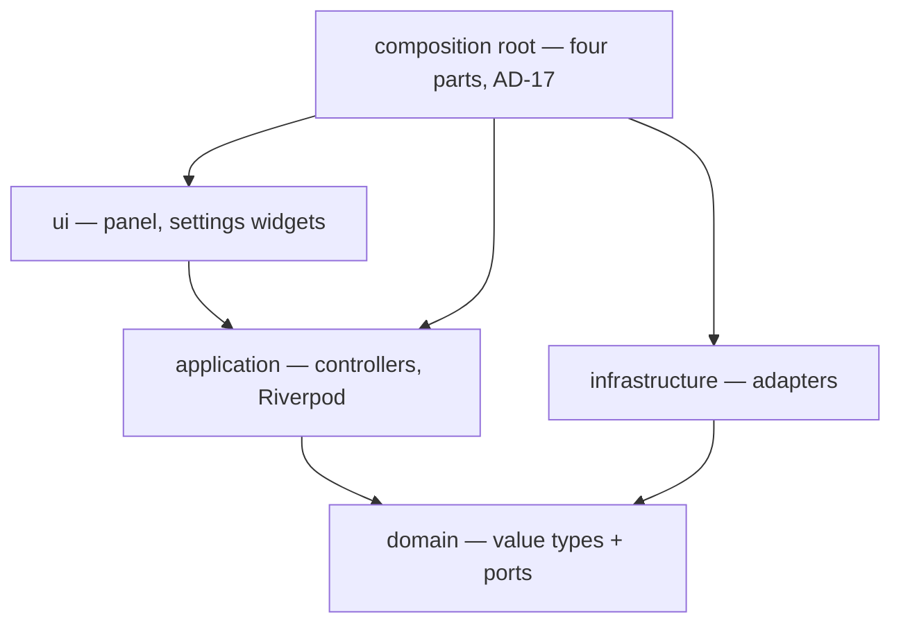
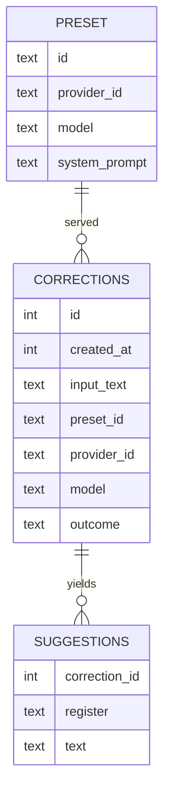

# Architecture Spine — Hotkey Grammar Corrector

## Design Paradigm

**Hexagonal (ports and adapters)**, three rings, one direction of dependency.

| Ring | Directory | May import | Never imports |
| --- | --- | --- | --- |
| **domain** — value types + port interfaces + pure logic | `lib/src/domain/` | `dart:*` core only | `package:flutter/*`, drift, dbus, any plugin |
| **application** — use cases, controllers, Riverpod state | `lib/src/application/` | domain, Riverpod | infrastructure, Flutter widgets |
| **infrastructure** — port implementations | `lib/src/infrastructure/` | domain, plugins, vendor SDKs | application, ui |
| **ui** — widgets | `lib/src/ui/` | application, domain (read-only types) | infrastructure |

Every port is declared in `domain/`. Adapters depend inward; the composition root is the only place that knows both sides. It is not one file — AD-17 fixes its four parts and which half of the knowledge each holds.



## Invariants & Rules

### AD-1 — Domain, application, and UI dependency direction is mechanically enforced

- **Binds:** all
- **Prevents:** domain code acquiring a Flutter, drift, or D-Bus import, which would make the correction logic untestable without a binding and un-swappable across display servers.
- **Rule:** `lib/src/domain/**` imports only `dart:` libraries. `lib/src/application/**` never imports `lib/src/infrastructure/**`; UI never imports infrastructure. Violations of these gated rings fail the merge gate. Infrastructure still must depend inward under the paradigm above; its missing mechanical check is recorded below.
- **Mechanism (user-ratified 2026-08-06):** the Dart 3.12 analyzer has no `analysis_options.yaml`-native import ban, and analyzer plugins would require out-of-Stack dependencies. `test/architecture/ad1_import_rule_test.dart` gates domain, application, and UI imports. It does not yet scan infrastructure imports; that part of the table remains an open enforcement gap under Deferred, not a claim that the current test covers it.

### AD-2 — The provider port signature is fixed here, verbatim

- **Binds:** CAP-4, CAP-5, CAP-7, CAP-8, CAP-9, CAP-13
- **Prevents:** two independently-built adapters, fakes, and the panel each inventing their own field names, so nothing interoperates. AGENTS.md §4.1 published an *illustrative* sketch and deferred the final names to this step — these are the final names.
- **Rule:** use these declarations exactly.

```dart
// domain/correction/suggestion_register.dart
/// Declaration order defines both the 1/2/3 key slots and the panel order.
enum SuggestionRegister { formal, casual, shorter }

// domain/correction/suggestion.dart
/// One register variant of a correction. The same shape the history DB persists.
final class Suggestion {
  const Suggestion({required this.register, required this.text});
  final SuggestionRegister register;
  final String text;
}

// domain/correction/preset.dart
/// Prompt and model, bound as one unit. Never separated.
final class Preset {
  const Preset({
    required this.id,
    required this.providerId,
    required this.model,
    required this.systemPrompt,
  });
  final String id;
  final String providerId;
  final String model;
  final String systemPrompt;
}

// domain/correction/correction_event.dart
sealed class CorrectionEvent {
  const CorrectionEvent();
}

/// Streamed partial text appended to one register's slot (CAP-5).
final class SuggestionDelta extends CorrectionEvent {
  const SuggestionDelta({required this.register, required this.textDelta});
  final SuggestionRegister register;
  final String textDelta;
}

/// Terminal. Carries exactly one Suggestion per SuggestionRegister value.
final class CorrectionCompleted extends CorrectionEvent {
  const CorrectionCompleted({required this.suggestions});
  final List<Suggestion> suggestions;
}

/// Terminal. Rendered inline in the panel with a Retry action (CAP-13).
final class CorrectionFailed extends CorrectionEvent {
  const CorrectionFailed({required this.kind, required this.message});
  final CorrectionFailureKind kind;
  final String message;
}

enum CorrectionFailureKind { timeout, providerUnavailable, providerError, malformedResponse }

// domain/correction/correction_provider.dart
abstract interface class CorrectionProvider {
  /// Text in, stream out. Stateless: no state survives between calls.
  Stream<CorrectionEvent> correct({required String text, required Preset preset});
}
```

- **Rule:** the declared fields and constructors above are the fixed part. A type may add `operator==`/`hashCode` over exactly those fields and nothing else — and `Suggestion`, `Preset`, and `CorrectionFailed` do, because each is compared by value by something that holds it: AD-7's `CorrectionRecord` holds a `List<Suggestion>`, `AppConfig` a `List<Preset>`, and the panel's immutable controller state its rendered `CorrectionFailed` — none of which can compare by value while its elements compare by identity. Equality is added where a consumer needs it, not everywhere it could go: `SuggestionDelta` and `CorrectionCompleted` keep identity equality. **Collection fields compare by contents and hash to match:** `List` in order and `Map` by key/value pairs regardless of insertion order (`AppConfig.providers`, `ProviderConfig.settings`). Identity equality for either collection would defeat the enclosing value type.

### AD-3 — Exactly one terminal event; a provider never throws across the boundary

- **Binds:** CAP-5, CAP-13, every `CorrectionProvider` implementation and fake
- **Prevents:** one adapter reporting failure as an exception and another as an event, so the panel's error/Retry path works against one provider and crashes against the next.
- **Rule:** every stream emits zero or more `SuggestionDelta`, then exactly one `CorrectionCompleted` **or** `CorrectionFailed`, then closes. No exception escapes `correct()`. `CorrectionCompleted.suggestions` always has one entry per `SuggestionRegister` value.
- **Rule:** `SuggestionDelta.textDelta` is an **incremental fragment, never cumulative**. The consumer concatenates fragments per register; a producer that re-sends the whole accumulated string each tick is broken. Deltas may arrive for registers in any order and interleaved.
- **Rule:** `CorrectionCompleted.suggestions` is **authoritative and replaces** whatever the consumer accumulated from deltas. Deltas are a progressive-rendering optimisation, not the record of truth — only the completed suggestions are shown after completion and persisted.

### AD-4 — Cancellation is subscription cancellation, and only three things cancel

- **Binds:** CAP-7, CAP-13, CAP-14
- **Prevents:** a Retry or a shutdown leaving an orphaned subprocess running — and, in the other direction, a hide silently destroying a correction that CAP-7 requires be retained.
- **Rule:** `correct()` returns a **single-subscription** stream. Cancelling the subscription is the cancellation signal; the adapter must tear down all work (kill the child process, close the socket) in `onCancel`. No `CorrectionEvent` is emitted after cancellation. This is the Dart form of AGENTS.md §6's cancellation requirement.
- **Rule:** exactly three things cancel an in-flight correction: pressing Retry, starting a new correction, and daemon shutdown. **Hiding the panel does not cancel** — the correction runs to its terminal event and is persisted, because CAP-7 retains every correction and CAP-14's assumption states that hiding discards nothing. A correction that completes while hidden is still persisted; its suggestions are then dropped from the UI when the panel next re-seeds (AD-18).

### AD-5 — Preset is indivisible; provider selection happens only at the composition root

- **Binds:** CAP-8, CAP-9
- **Prevents:** a `switch (providerId)` appearing inside the correction pipeline, which is exactly the open/closed violation AGENTS.md §5 rules out.
- **Rule:** the composition root reads `AppConfig`, resolves the single active `(CorrectionProvider, Preset)` pair, and injects it — in `infrastructure/correction/active_correction.dart`, which is AD-17's fourth part, so the resolution is reachable by a test. Nothing below the composition root selects a provider or accepts a model id without its prompt. Adding a provider means adding one file and one config entry.

### AD-6 — Register ordering is the key mapping; persist by name

- **Binds:** CAP-4, CAP-7
- **Prevents:** the panel and the database disagreeing about which variant is "2", and a future enum reorder silently rewriting the meaning of stored history.
- **Rule:** `SuggestionRegister.values.indexOf(r) + 1` is the selecting key (1/2/3) and the panel's top-to-bottom order. Persist the enum's `name` string, never its index.

### AD-7 — `suggestions[]` projects onto two tables

- **Binds:** CAP-7, CAP-8
- **Prevents:** a "wire model" and a "db model" drifting apart, and history becoming uninterpretable once the operator switches provider or model.
- **Rule:** exactly this schema; the repository maps `CorrectionCompleted` onto it with no intermediate model.
- **Rule:** `CorrectionController` is the **sole caller** of `CorrectionRepository.save`, once, at the terminal event. Provider adapters never persist. Two writers would double-count every correction in the history that CAP-7 exists to build.

```sql
CREATE TABLE corrections (
  id            INTEGER PRIMARY KEY AUTOINCREMENT,
  created_at    INTEGER NOT NULL,   -- unix millis, UTC
  input_text    TEXT    NOT NULL,   -- the edited text actually sent (CAP-3)
  preset_id     TEXT    NOT NULL,
  provider_id   TEXT    NOT NULL,
  model         TEXT    NOT NULL,
  latency_ms    INTEGER NOT NULL,
  outcome       TEXT    NOT NULL,   -- 'completed' | 'failed'
  failure_kind  TEXT             -- CorrectionFailureKind.name, NULL when completed
);

CREATE TABLE suggestions (
  correction_id INTEGER NOT NULL REFERENCES corrections(id) ON DELETE CASCADE,
  register      TEXT    NOT NULL,   -- SuggestionRegister.name
  text          TEXT    NOT NULL,
  PRIMARY KEY (correction_id, register)
);

CREATE INDEX corrections_created_at_idx ON corrections (created_at);
```

`provider_id`, `model`, and `preset_id` are load-bearing, not metadata: CAP-8 lets the backend change under the user, and history without them cannot be read the first time someone switches models. One write, at the terminal event, inside a transaction.

### AD-8 — Panel visibility is synchronous in-process state; the hotkey toggle reads it

- **Binds:** CAP-1, CAP-14
- **Prevents:** the toggle awaiting a window-manager round trip on the show path, putting CAP-1's 100 ms budget at the mercy of IPC — and prevents a show-only handler that ignores current visibility.
- **Rule:** the port exposes visibility as a **synchronous** field, kept current by the adapter from window events (including the focus-loss hide). The toggle never `await`s before deciding.

```dart
// domain/panel/panel_visibility.dart
enum PanelVisibilityState { shown, dismissed, iconified, focusLost }

abstract interface class PanelVisibility {
  /// Synchronous in-process mirror. Never an IPC query.
  bool get isVisible;

  /// Emits a transition and distinguishes dismissal from survivable departures.
  Stream<PanelVisibilityState> get changes;

  Future<void> show();   // show + focus an already-constructed window
  Future<void> hide();
}
```

```dart
// application/panel_controller.dart — hotkey decision
void onHotkeyActivated() {
  if (_visibility.isVisible) {
    if (_settingsVisible) {
      _requestShow(); // return from Settings to the panel
      return;
    }
    _visibility.hide();
    return;
  }
  _requestShow();
}
```

`_requestShow()` fires `show()` on the already-constructed window, handles its future without awaiting it, and emits `showRequests` so the visible Settings surface can return to the panel. The hotkey decision does no clipboard or other I/O. Session seeding follows the visibility transition under AD-18, after the window is shown.

- **Rule (D-16):** prepare size and best-effort placement while the panel is hidden, using startup or cached geometry. Wayland compositor placement governs its top-level window. The hotkey path performs no pointer/display query; exact current-pointer-display centering is waived and was not verified by this document update.

### AD-9 — One `GlobalHotkey` port, two adapters, chosen once at startup

- **Binds:** CAP-1, CAP-12
- **Prevents:** X11 grab semantics leaking above the port and making the Wayland path a rewrite — the exact failure `risks.md` warns about.
- **Rule:** the port below is the only hotkey surface anything above infrastructure sees. The composition root reads `XDG_SESSION_TYPE` (falling back to the presence of `WAYLAND_DISPLAY`), constructs exactly one adapter, and never switches at runtime.

```dart
// domain/hotkey/hotkey_binding.dart
enum HotkeyModifier { control, alt, shift, meta }

final class HotkeyBinding {
  HotkeyBinding({required Set<HotkeyModifier> modifiers, required this.key})
    : modifiers = Set<HotkeyModifier>.unmodifiable(modifiers);
  final Set<HotkeyModifier> modifiers;
  final String key;   // logical key label, e.g. 'Space', 'G'
}

// domain/hotkey/global_hotkey.dart
enum BindingAuthority { application, compositor }

final class HotkeyRegistration {
  const HotkeyRegistration({required this.effective, required this.authority});
  /// What is actually in effect. null when the backend cannot report it.
  final HotkeyBinding? effective;
  final BindingAuthority authority;
}

// domain/hotkey/hotkey_bind_outcome.dart
/// What a bind request resolved to. Unavailability is a value, never a throw (AD-12).
sealed class HotkeyBindOutcome {
  const HotkeyBindOutcome();
}

/// A backend took the request; [registration] states what is in effect (AD-10).
final class HotkeyBound extends HotkeyBindOutcome {
  const HotkeyBound(this.registration);
  final HotkeyRegistration registration;
}

/// A replacement was refused while the prior registration remains held.
final class HotkeyRetained extends HotkeyBindOutcome {
  const HotkeyRetained(this.registration);
  final HotkeyRegistration registration;
}

/// No binding is held. The tray menu is the fallback where a tray host exists.
final class HotkeyUnavailable extends HotkeyBindOutcome {
  const HotkeyUnavailable({required this.cause, required this.message});
  final HotkeyUnavailableCause cause;
  final String message;
}

enum HotkeyUnavailableCause { noBackend, keyRefused, revoked }

// domain/hotkey/hotkey_status.dart
final class HotkeyStatus {
  const HotkeyStatus({required this.outcome, required this.backendDescription});
  final HotkeyBindOutcome outcome;
  final String? backendDescription; // localized desktop text, not a binding
}

// domain/hotkey/global_hotkey.dart (continued)
abstract interface class GlobalHotkey {
  /// One event per press of the currently bound combination.
  Stream<void> get activations;

  /// Synchronous cached status; null before any backend request.
  HotkeyStatus? get current;

  /// Changes the **backend** originated — never an answer to a call this app
  /// made, which [bind] already gives. Broadcast. An adapter whose backend
  /// cannot originate one (an X11 grab is only ever changed through [bind])
  /// implements it as an empty stream that closes.
  Stream<HotkeyBindOutcome> get bindingChanges;

  /// Requests [binding]. The return value states what is actually in effect.
  Future<HotkeyBindOutcome> bind(HotkeyBinding binding);

  Future<void> dispose();
}
```

- **Rule:** the declared fields and constructors above are the fixed part. D-21 adds `HotkeyRetained` without changing the existing declarations. `HotkeyRegistration`, `HotkeyBinding`, `HotkeyBound`, `HotkeyRetained`, and `HotkeyUnavailable` compare/hash their declared fields; `HotkeyUnavailable` includes both `cause` and `message`. `HotkeyBinding.modifiers` compares as an unordered **set** and hashes unordered to match. Its non-`const` defensive copy is owner-ratified by D-19 (2026-09-24); the earlier Phase 1 unattended choice is retained as separate provenance in the memlog.
- **Rule:** `bindingChanges` is what carries AD-10's second half — "a rebind made in the compositor updates the UI". `bind()`'s return value cannot: it answers only the call this app made, so without a separate stream the Wayland adapter's `ShortcutsChanged` subscription has nowhere to deliver.
- **Rule:** a `bindingChanges` event observed by a listener after `bind()` was issued supersedes that bind answer, even in the same turn. A listener orders by observation, not backend emission time; `current` covers changes the adapter observed while no consumer was mounted. The event carries only an outcome, while the localized description lives in `current`: equal outcome events must not be deduplicated as though they imply equal descriptions, and a cache read is the latest status rather than an atomic field of that event. An event/cache interleaving remains a source-level risk, listed under Deferred.

`HotkeyBinding` is the domain type; adapters serialize it to backend vocabularies only in infrastructure. Wayland sends an XDG `preferred_trigger`. X11's shipped `X11KeyGrabRegistrar` resolves the catalogue's key label to an X keysym and modifier mask through libX11 FFI; the removed `hotkey_manager`/keybinder accelerator path is not a runtime dependency.

### AD-10 — `bind()` reports the effective binding and who owns it

- **Binds:** CAP-12
- **Prevents:** the settings UI claiming it set a hotkey that the compositor actually chose. Under the GlobalShortcuts portal the **compositor and user** pick the combination; `preferred_trigger` is a hint and the portal shows its own dialog.
- **Rule:** the settings screen renders `HotkeyRegistration` and the cached `HotkeyStatus`, not a claimed Wayland grant inferred from the request. When `authority == compositor`, the submitted binding is a *preference*. Persist a structured `effective` binding in place of that preference when reported (D-18). The shipped portal reports only localized `trigger_description`, so its `effective` is null: display that description as desktop-authored wording without parsing it into a combination. After a successful unstructured bind, keep the submitted preference as restart seed; after `HotkeyRetained`, keep the prior saved seed and show the refusal. A newer `bindingChanges` event supersedes the bind answer: persist its structured effective binding if one exists, otherwise preserve the seed already saved. `ShortcutsChanged` feeds that stream; revoked and unavailable states remain distinct. This route reflects source-level event handling, but the shipped initial bind/read-back/subscription order has an unobserved-signal window noted under Deferred.

### AD-11 — The Wayland portal call order is itself an invariant

- **Binds:** CAP-1, CAP-12
- **Prevents:** the silent, hard-to-diagnose failure mode where `CreateSession` is rejected for an empty app id, or GNOME discards the bind for an app id with no matching desktop entry.
- **Rule:** the Wayland adapter performs exactly this sequence on the session bus, in this order.

1. For an **unsandboxed** `PortalAppIdRegime`, call `org.freedesktop.host.portal.Registry.Register("com.divertedriver.HotkeyGrammarCorrector")` on `/org/freedesktop/host/portal/registry` **once, before any other portal call**. Tolerate `UnknownMethod` / `ServiceUnknown` (portal < 1.20 has no Registry). A sandboxed build skips host registration.
2. `org.freedesktop.portal.GlobalShortcuts.CreateSession` on `/org/freedesktop/portal/desktop`, passing `handle_token` and `session_handle_token`; await the `Response` signal on the returned Request path.
3. `BindShortcuts(session, [("toggle-panel", {description, preferred_trigger})], parent_window: "", options)`; await `Response` and read the bound shortcuts back.
4. Subscribe to `Activated` — `(o session_handle, s shortcut_id, t timestamp, a{sv} options)` — filtering on session handle and `shortcut_id == "toggle-panel"`. Subscribe to `ShortcutsChanged`.

The app id must be reverse-DNS **and** have an installed `.desktop` file of the same basename. Shipping `com.divertedriver.HotkeyGrammarCorrector.desktop` into `~/.local/share/applications/` is a hard requirement of the hotkey working, not packaging polish. Step 4 currently follows the step 3 read-back; a compositor change in that interval could be missed, so this order is recorded as shipped behavior rather than proof that every rebind is observed.

### AD-12 — Any refusal to hold the hotkey degrades visibly

- **Binds:** CAP-1, CAP-13
- **Prevents:** a crash, an unhandled async error, or a silently dead hotkey on **any** path where a backend will not hold the combination — whichever adapter is in play, and whether the refusal is *total* (no backend at all), *per-key* (a combination this build cannot register), *disguised as success* (a portal answering `BindShortcuts` while dropping the shortcut), or *after the fact* (a binding the compositor later revokes). The worked example, and the one that motivated this AD: a crash or a silently dead hotkey on wlroots compositors (Sway, Hyprland, Niri), which ship **no** GlobalShortcuts implementation — only GNOME and KDE do (verified 2026-08-06 against community tracking, not an upstream matrix — re-check before promising a compositor).
- **Rule — every refusal by every backend is a value, never an exception.** `bind()` never throws and never rejects, whatever the backend does. This is the arm *all* adapters degrade into, not a portal-only clause: an exception on any of these paths would surface as an unhandled async error in a daemon that must stay resident. The refusals include, and are not limited to, a portal `CreateSession` or `BindShortcuts` that fails; a `BindShortcuts` that **succeeds** while omitting our shortcut from the read-back, which is how a portal reports a bind it discarded (AD-11's app-id hazard — so the read-back is checked, not just the reply); a key `HotkeyKeyCatalogue` finds unrepresentable *before* the backend is touched; an X11 grab or release the backend refuses; and startup with neither a recognized `XDG_SESSION_TYPE` nor a nonempty `WAYLAND_DISPLAY`, which selects the X11 fallback: if `XOpenDisplay` cannot open a display, the subsequent bind reports `noBackend`.
- **Rule — which value, and this is the half that is easy to get wrong.** A refusal is `HotkeyUnavailable` **only when nothing is held**. A refused Wayland `Session.Close` that leaves the old session live abandons the rebind and returns `HotkeyRetained` carrying its prior registration; the old `Activated` filter and backend description stay in effect. A refused X11 replacement whose old grab is still held can return `HotkeyBound` carrying that prior combination, with `SettingsFailure.previousShortcutWorks` marking the refusal. Neither case may save or display the rejected request as the effective shortcut. A later backend event replaces a temporary retained status.
- **Rule — what the surfaces may claim.** At startup the tray receives a neutral unavailable boolean through `setHotkeyUnavailable(bool)`; later typed `HotkeyTrayStatus` updates can render cause-specific `noBackend`, `keyRefused`, or `revoked` menu lines. For `HotkeyRetained`, Settings and tray show a refused replacement while the previous shortcut still works; tray keeps the panel action available. Settings renders a cause-specific line, then `HotkeyUnavailable.message` verbatim (or its tray fallback when blank), then a current-status line: `revoked` says no shortcut is currently in effect, while the other causes say ownership is unknown until registration. Neither surface infers a display server or claims an active ownership regime for `HotkeyUnavailable`; it cannot call every failure "unavailable on this compositor."
- **Rule:** the tray menu can still open the panel, so the app stays usable. **The one hole in that fallback is known and is not this AD's to close:** on a session with no StatusNotifier host the indicator is silently absent — `tray_manager` 0.5.3's Linux `set_icon` never checks `app_indicator_new`'s result and answers success regardless, so nothing raises and no guard runs. It is filed as deferred work; every *other* tray failure surfaces.

### AD-13 — Config has exactly one owner and settings write through it

- **Binds:** CAP-8, CAP-12
- **Prevents:** the in-memory-only settings surface the SPEC rules out, and two code paths parsing the config file into two different shapes.
- **Rule:** one `ConfigStore` performs all file reads, validation, and writes, and emits an immutable `AppConfig`. Every settings mutation goes through it; nothing else opens the config file. A malformed file yields defaults plus a surfaced warning — never a failed startup for a resident daemon.

### AD-14 — The daemon is a singleton

- **Binds:** CAP-1, CAP-14
- **Prevents:** a second launch double-binding the hotkey and racing the panel. Nothing in the SPEC forbids launching twice, so the architecture must.
- **Rule:** acquire an abstract-namespace socket (or a lock file) under `$XDG_RUNTIME_DIR` at startup. If it is held, signal the running instance to show its panel, then exit 0.

### AD-15 — Correction transport stays outside the provider port

- **Binds:** CAP-8, and every present and future `CorrectionProvider`
- **Prevents:** the default provider's process transport or a compatible endpoint's HTTP fields changing the text-in/stream-out provider port or correction pipeline. Provider-contract principle 1 rules out both HTTP-shaped and subprocess-shaped callers.
- **Rule:** `CorrectionProvider` stays text-in/stream-out, with no process, HTTP, credential, or vendor SDK type. The shipped OpenAI-compatible Settings path edits a base URL and model; `ProviderConfig` validates that URL, and infrastructure's `SecretStore`/key-resolution edge reads credentials from environment, Secret Service, or a user-authored config field. This is a narrow existing exception to the prior blanket claim that nothing outside a provider adapter may name transport configuration. Model stays paired with prompt in `Preset`. Under D-17, a Settings rewrite preserves a key the user wrote into config but never creates one there or copies an environment/keyring key into it.
- **Rule:** core registration and selection of a provider whose settings already fit the generic config surface takes these three steps:
  1. add an adapter under `infrastructure/correction/` implementing `CorrectionProvider`, with private parsing helpers when needed;
  2. add one entry to the `providers` map in config, plus a `Preset` naming it;
  3. register it in the composition root's provider table (a `Map<String, CorrectionProvider Function(ProviderConfig)>`) — a lookup, not a `switch` in the pipeline.

  Provider-specific editable fields may also require a Settings and validation extension; the shipped compatible endpoint is such an extension. This does not change `CorrectionProvider` or the correction pipeline. A generic descriptor/validation seam for future editable fields remains deferred; the three-step core recipe alone does not satisfy the SPEC's two-surface rule for a new user-facing field.
- **Rule:** each adapter owns its own failure translation into `CorrectionFailureKind`. A missing executable, a refused connection, a 401, and an expired token are all `providerUnavailable` or `providerError` at the boundary; the vendor's error type never escapes (AGENTS.md §6).
- **Rule:** if the configured provider ID has no registered adapter, startup logs a warning and `ActiveCorrection` uses `UnconfiguredCorrectionProvider`. A correction emits one `CorrectionFailed(providerUnavailable, …)` for that ID. Startup stays usable; no other provider is selected as a fallback.
- **Rule:** every provider ships with a fake implementing the same port, used by tests. If the interface is awkward to fake, the interface is wrong (AGENTS.md §4.1).

### AD-16 — The shipped preset's wire format is register-tagged lines, not one JSON object

- **Binds:** CAP-4, CAP-5
- **Prevents:** CAP-5 being unimplementable. Partial JSON cannot be parsed incrementally, so a single JSON-object response forces the panel to wait for the closing brace — a blank panel until completion.
- **Rule:** the **shipped** preset's system prompt requires exactly four lines: `FORMAL:`, `CASUAL:`, `SHORTER:`, then the parser's `END` sentinel, in that order. The parser is **pure Dart** under `infrastructure/correction/shared/` and runs on the daemon side of the sidecar boundary (AD-19), so it is unit-testable on plain strings with no process involved, as AGENTS.md §7 requires. It routes each text delta to the current register's slot and emits `SuggestionDelta`; only a complete sentinel-terminated stream assembles `CorrectionCompleted`. Missing or extra tags, a missing sentinel, or a truncated final line produce `CorrectionFailed(malformedResponse, …)`.
- **Rule:** the tagged-line wire format belongs to this adapter, not the whole system. A provider with native structured streaming may use that instead. A selectable production provider must emit meaningful partial `SuggestionDelta` events before successful completion to satisfy CAP-5 and AGENTS.md's substitution rule. A backend that cannot stream needs an explicit product decision before it is offered; AD-3's zero-delta allowance covers failures before any partial can arrive, not a successful non-streaming substitute.

### AD-17 — Riverpod lives in application and ui only

- **Binds:** all
- **Prevents:** a service locator reaching into domain code, which AGENTS.md §5 rules out, while still satisfying its "one state approach, used consistently".
- **Rule:** domain types take their ports through constructors and never import Riverpod. Riverpod providers in `application/composition/` **are** the wiring: `port_providers.dart` declares one typed seam per port, `controller_providers.dart` constructs the controllers, `daemon_graph.dart` eagerly builds them and owns controller dispose order.
- **Rule:** the composition root is **four parts**, and a reader looking for one of them should expect it here:
  1. `main.dart` — constructs the vendor adapters, installs `UncontrolledProviderScope` over the container `DaemonGraph` already holds (not a `ProviderScope` that builds its own), sequences the platform half of startup, and owns the pre-lifecycle abort path and the signal handlers.
  2. `application/composition/` — the Riverpod graph above.
  3. `infrastructure/system/daemon_startup.dart` — the pre-Flutter startup order (AD-14 → AD-13 → AD-9 → AD-5), including the display-server adapter choice; `daemon_lifecycle.dart` — the runtime teardown order. Both sit in `infrastructure/` and so may not import `application/`: the container-side steps reach them as bare callbacks, and neither ever sees a `ProviderContainer`. That is what keeps AD-1 whole while the order stays in a type a test can construct.
  4. `infrastructure/correction/active_correction.dart` — AD-5's `(CorrectionProvider, Preset)` pair resolution.
- **Rule:** the split exists because **`main()` is reachable by no test** — it needs a binding, a window, and a display, so anything left inside it is unverifiable and `composition_wiring_test.dart` can only scan it as text. Everything decidable without a platform therefore moves into a type a test can construct. `main.dart` sits outside `lib/src/`, and so outside AD-1's ring gate, which is exactly what lets the graph in `application/composition/` declare its seams over domain ports alone.

### AD-18 — Dismissal ends a panel session; Retry replays the submitted text

- **Binds:** CAP-2, CAP-3, CAP-13, CAP-14
- **Prevents:** the three places where the panel's lifecycle is under-specified and two independently-written units would each pick a defensible, incompatible answer — re-seeding, Retry identity, and what survives a hide.
- **Rule:** a dismissal ends the session. A later summon creates a fresh one, clears prior suggestions/error/edits, then seeds the editor from the *current readable plain-text* clipboard. An empty, non-text, or failed read leaves a usable blank editor. A return after iconification or focus loss preserves the existing editor, suggestions, and active correction and reads no clipboard. Showing an already visible window to return from Settings is not a new session. CAP-1's hotkey path only raises the warm window; clipboard I/O occurs after the show transition.
- **Rule:** the correction runs on the editor's content at the moment the user submits (CAP-3), and the controller **captures that exact string** as the session's submitted text. Retry re-sends the captured string, not whatever the editor holds at retry time, so CAP-13's "same input text" holds even if the user typed in the meantime.
- **Rule:** the panel stays open after a copy and every variant remains copyable (CAP-14). Copying is never implicit in selection — selecting with 1/2/3 only highlights.

### AD-19 — The shipped default adapter hosts the Claude Agent SDK out of process

- **Binds:** CAP-5, CAP-8, CAP-9
- **Prevents:** a search for a Dart binding that does not exist. The Claude Agent SDK ships only as `claude-agent-sdk` (Python) and `@anthropic-ai/claude-agent-sdk` (TypeScript); a Flutter host cannot link either in-process. Provider-contract principle 1 explicitly permits a local process, so this is contract-compliant rather than a workaround.
- **Rule:** one child process **per correction**, never reused and never resumed. That is the mechanism enforcing the SPEC's stateless-session constraint — there is no session id to carry, so no context can leak between corrections even by accident.
- **Rule:** killing the process is the `onCancel` implementation required by AD-4. The adapter must reap it, not orphan it.
- **Rule — kill the process *group*, not the process.** Because the chain is three deep, signalling only the Python PID leaves the `claude` CLI grandchild running and still talking to the network. Spawn the sidecar in its own process group and signal the group (`SIGTERM`, then `SIGKILL` after a short grace period). This is the single easiest thing to get wrong here, and the symptom — orphaned `claude` processes accumulating across a day of Retries in a daemon that never exits — appears long after the code that caused it.
- **Rule:** the executable path is a config value, not a compiled-in constant. A missing or non-executable host yields `CorrectionFailed(providerUnavailable, …)` on the first correction; it must not prevent the daemon from starting, because the tray, panel, and settings all have to remain reachable for the user to fix the setting.
- **Seed — the host is a bundled Python sidecar** importing `claude_agent_sdk`, chosen over invoking the `claude` CLI directly so the adapter codes against a supported API surface instead of version-sensitive CLI flags. Note it does **not** remove the CLI dependency: the Python SDK manages the same `claude` CLI as a subprocess, so the chain is Dart → Python → CLI, and `claude` must still be on `PATH`. Swapping to the direct CLI later is one file under AD-15.
- **Rule — the sidecar is a transport shim, not a place for logic.** It holds no register parsing, no prompt assembly, and no retry policy. AGENTS.md §7 requires prompt/response mapping to be pure Dart and unit-testable without a Flutter binding, and logic inside a Python asset is reachable by neither `dart test` nor `dart analyze`. Everything the sidecar does must be describable as "move bytes and translate lifecycle".
- **Rule — the sidecar protocol is fixed here.** One correction per process. Dart writes a single JSON line to stdin then **closes stdin**; the sidecar streams NDJSON on stdout and exits. Non-zero exit or unparseable output is `providerError`; a failure to spawn is `providerUnavailable`.

```jsonc
// Dart -> sidecar: exactly one line, then stdin closes
{"text": "...", "model": "claude-sonnet-5", "system_prompt": "..."}

// sidecar -> Dart: NDJSON on stdout. Raw model text, forwarded verbatim.
{"type": "text",  "text": "FORM"}
{"type": "text",  "text": "AL: I have reviewed ..."}
{"type": "done"}
// or, instead of done:
{"type": "error", "kind": "providerError", "message": "..."}
```

- **Rule:** the sidecar forwards **raw model text**; it does not interpret the `FORMAL:`/`CASUAL:`/`SHORTER:` tags or `END` sentinel. The Dart-side `RegisterTaggedStreamParser` (AD-16) turns that text stream into `SuggestionDelta` events and the final `CorrectionCompleted`, and is unit-tested on plain strings with no process involved. `{"type":"done"}` means the text stream ended, **not** that the correction succeeded — if the parser cannot recover three tagged registers followed by the sentinel, the adapter emits `CorrectionFailed(malformedResponse, …)`.
- **Rule:** the sidecar ships as a versioned asset under `assets/sidecar/`, and both interpreter path and sidecar path are config values (AD-13). Pin the `claude_agent_sdk` version in a `requirements.txt` beside it; an interpreter that cannot import it yields `providerUnavailable` with a message naming the missing package, so the failure is actionable in the panel rather than mysterious.

## Consistency Conventions

| Concern | Convention |
| --- | --- |
| Naming | Ports are role nouns without an `I` prefix (`CorrectionProvider`, `GlobalHotkey`, `PanelVisibility`). Adapters are `<Technology><Port>` (`X11GlobalHotkey`, `WaylandPortalGlobalHotkey`, `DriftCorrectionRepository`, `ClaudeAgentSdkCorrectionProvider`). Fakes are `Fake<Port>` and live in `test/fakes/`. |
| Files | One public type per file; filename is the snake_case of the type (AGENTS.md §3). |
| Time | Every timestamp is unix milliseconds UTC, obtained from the `Clock` port — never `DateTime.now()` outside the clock adapter. |
| Ids | `provider_id` and `preset_id` are lowercase kebab-case strings from config (`claude-agent-sdk`, `default-formal-casual-shorter`). Database keys are integers and never leave the repository. |
| Errors | Expected failures are modelled values (`CorrectionEvent`, `HotkeyRegistration`, `HotkeyUnavailable`). Exceptions signal programmer error only, and never cross a port boundary as a vendor type. |
| Enums in storage/config | Always persisted and serialized by `.name`, never by index. |
| State mutation | Immutable state objects with `copyWith`; a single controller per surface owns its state. Widgets never mutate state outside their own ephemeral UI concerns. |
| Config & data paths | Config: `${XDG_CONFIG_HOME:-~/.config}/hotkey-grammar-corrector/config.json`. Data: `${XDG_DATA_HOME:-~/.local/share}/hotkey-grammar-corrector/history.sqlite`. Resolved in one `AppPaths` type. |
| Logging | Structured lines to stderr through one `Logger` port. Never log `input_text` or suggestion bodies — the daemon reads the clipboard. |
| Tests | Cite the CAP id in the test name; domain and parsing tests run without a Flutter binding. |

## Stack

**Reconciled to the checked-in manifests 2026-09-26.** Pub versions and the Dart floor below come from `pubspec.yaml`; the Flutter and sidecar pins cite their executable homes. This pass checks the repository's pins, not upstream latest versions. `drift_flutter` and `hotkey_manager` are absent from the shipped dependency graph, so neither appears as a required package.

| Name | Version |
| --- | --- |
| Flutter (stable) | pinned in `.github/workflows/ci.yml` |
| Dart SDK | `^3.12.2` in `pubspec.yaml` |
| flutter_riverpod | 3.4.2 |
| drift | 2.34.3 |
| drift_dev (dev) | 2.34.0 |
| build_runner (dev) | 2.15.1 |
| sqlite3 | 3.5.1 |
| ffi | 2.2.0 |
| dbus | 0.7.14 |
| window_manager | 0.5.2 |
| tray_manager | 0.5.3 |
| flutter_lints (dev) | 6.0.0 |
| test (dev) | 1.31.0 |
| Python (sidecar interpreter) | configured `python3`; provisioner checks presence, not version |
| claude_agent_sdk (pip, imported by the Python sidecar) | pinned in `assets/sidecar/requirements.txt` |
| `claude` CLI (spawned by the Python SDK) | on `PATH` |
| Default model | `claude-sonnet-5` |

**Two rows cite instead of restating.** The Flutter toolchain and the `claude_agent_sdk` pin each already have an executable home — the workflow a runner installs from, and the requirements file `tool/provision_sidecar.sh` installs from. A number written here as well would be a second writable copy of one fact, free to disagree with the copy that actually ships; the citation is a pointer to the executable home instead. `test/architecture/sidecar_pin_drift_test.dart` checks that both citations resolve *and* that neither cell has grown a version back beside the citation. It does not make this table the only place either number appears: `.devcontainer/Dockerfile`'s `FLUTTER_VERSION` (with its coupled `FLUTTER_SHA256`) and `pubspec.yaml`'s `flutter:` constraint are further hand-maintained copies that no gate covers.

X11 hotkeys use `X11KeyGrabRegistrar` over libX11 FFI. The removed `hotkey_manager` plugin and its `libkeybinder-3.0.so.0` loader dependency do not ship.

**Pin renegotiation (user-ratified 2026-08-06):** `drift_dev` and `build_runner` were originally pinned at 2.34.5 / 2.16.0, which did not resolve with the selected Flutter/Riverpod graph. The manifest now pins 2.34.0 / 2.15.1. `drift_flutter` and the native sqlite packages behind its earlier EOL warning were removed; `sqlite3` uses Dart build hooks in the shipped graph.

## Structural Seed

This is the current tracked `lib/` file map, including generated source. Code owns the structure after this snapshot; the ADs above own the invariants.

```text
lib/main.dart
lib/src/application/composition/controller_providers.dart
lib/src/application/composition/daemon_graph.dart
lib/src/application/composition/port_providers.dart
lib/src/application/correction_controller.dart
lib/src/application/correction_state.dart
lib/src/application/hotkey_capture.dart
lib/src/application/panel_controller.dart
lib/src/application/settings_controller.dart
lib/src/application/settings_state.dart
lib/src/domain/clipboard/clipboard_port.dart
lib/src/domain/clock.dart
lib/src/domain/collection_equality.dart
lib/src/domain/config/app_config.dart
lib/src/domain/config/config_load_result.dart
lib/src/domain/config/config_store.dart
lib/src/domain/config/config_write_conflict.dart
lib/src/domain/config/provider_config.dart
lib/src/domain/config/secret_store.dart
lib/src/domain/correction/correction_event.dart
lib/src/domain/correction/correction_outcome.dart
lib/src/domain/correction/correction_provider.dart
lib/src/domain/correction/correction_record.dart
lib/src/domain/correction/preset.dart
lib/src/domain/correction/suggestion.dart
lib/src/domain/correction/suggestion_register.dart
lib/src/domain/history/correction_repository.dart
lib/src/domain/hotkey/global_hotkey.dart
lib/src/domain/hotkey/hotkey_bind_outcome.dart
lib/src/domain/hotkey/hotkey_binding.dart
lib/src/domain/hotkey/hotkey_status.dart
lib/src/domain/hotkey/registrable_keys.dart
lib/src/domain/logger.dart
lib/src/domain/panel/panel_visibility.dart
lib/src/domain/tray/hotkey_tray_status.dart
lib/src/domain/tray/tray_port.dart
lib/src/infrastructure/clipboard/system_clipboard.dart
lib/src/infrastructure/config/app_paths.dart
lib/src/infrastructure/config/default_app_config.dart
lib/src/infrastructure/config/json_config_store.dart
lib/src/infrastructure/config/provider_secret_fields.dart
lib/src/infrastructure/correction/active_correction.dart
lib/src/infrastructure/correction/api_key_resolver.dart
lib/src/infrastructure/correction/api_key_source.dart
lib/src/infrastructure/correction/claude_agent_sdk/claude_agent_sdk_correction_provider.dart
lib/src/infrastructure/correction/claude_agent_sdk/register_tagged_stream_parser.dart
lib/src/infrastructure/correction/claude_agent_sdk/sidecar_host_paths.dart
lib/src/infrastructure/correction/claude_agent_sdk/sidecar_protocol.dart
lib/src/infrastructure/correction/openai_compatible/chat_completion_sse_decoder.dart
lib/src/infrastructure/correction/openai_compatible/openai_compatible_correction_provider.dart
lib/src/infrastructure/correction/provider_registry.dart
lib/src/infrastructure/correction/secret_service_secret_store.dart
lib/src/infrastructure/correction/shared/register_tagged_stream_parser.dart
lib/src/infrastructure/correction/unconfigured_correction_provider.dart
lib/src/infrastructure/hotkey/display_server.dart
lib/src/infrastructure/hotkey/hotkey_grab.dart
lib/src/infrastructure/hotkey/hotkey_key_catalogue.dart
lib/src/infrastructure/hotkey/hotkey_registrar.dart
lib/src/infrastructure/hotkey/portal_app_id_regime.dart
lib/src/infrastructure/hotkey/wayland_portal_global_hotkey.dart
lib/src/infrastructure/hotkey/x11_global_hotkey.dart
lib/src/infrastructure/hotkey/x11_key_grab_registrar.dart
lib/src/infrastructure/hotkey/xdg_shortcut_trigger.dart
lib/src/infrastructure/panel/absent_keyboard_focus_witness.dart
lib/src/infrastructure/panel/keyboard_focus_witness.dart
lib/src/infrastructure/panel/panel_window.dart
lib/src/infrastructure/panel/window_manager_panel_visibility.dart
lib/src/infrastructure/panel/window_manager_panel_window.dart
lib/src/infrastructure/panel/x11_keyboard_focus_witness.dart
lib/src/infrastructure/persistence/app_database.dart
lib/src/infrastructure/persistence/app_database.g.dart
lib/src/infrastructure/persistence/drift_correction_repository.dart
lib/src/infrastructure/persistence/history.drift
lib/src/infrastructure/system/daemon_lifecycle.dart
lib/src/infrastructure/system/daemon_startup.dart
lib/src/infrastructure/system/single_instance_lock.dart
lib/src/infrastructure/system/stderr_logger.dart
lib/src/infrastructure/system/system_clock.dart
lib/src/infrastructure/tray/tray_icon.dart
lib/src/infrastructure/tray/tray_manager_tray.dart
lib/src/infrastructure/tray/tray_manager_tray_icon.dart
lib/src/infrastructure/tray/tray_menu_entry.dart
lib/src/ui/daemon_app.dart
lib/src/ui/daemon_home.dart
lib/src/ui/panel/correction_error_notice.dart
lib/src/ui/panel/correction_panel.dart
lib/src/ui/panel/original_text_pane.dart
lib/src/ui/panel/register_key_slot.dart
lib/src/ui/panel/suggestion_card.dart
lib/src/ui/panel/suggestion_list.dart
lib/src/ui/settings/hotkey_binding_label.dart
lib/src/ui/settings/hotkey_capture_field.dart
lib/src/ui/settings/hotkey_status_view.dart
lib/src/ui/settings/preset_choice_list.dart
lib/src/ui/settings/settings_failure_notice.dart
lib/src/ui/settings/settings_pending_notice.dart
lib/src/ui/settings/settings_screen.dart
assets/sidecar/claude_agent_sdk_sidecar.py
assets/sidecar/requirements.txt
linux/packaging/com.divertedriver.HotkeyGrammarCorrector.desktop
```

**Correction flow** — the one sequence every capability sits on:

```mermaid
sequenceDiagram
    participant HK as GlobalHotkey adapter
    participant PC as PanelController
    participant PV as PanelVisibility
    participant CC as CorrectionController
    participant CP as CorrectionProvider
    participant Repo as CorrectionRepository

    HK->>PC: activations event
    PC->>PV: isVisible (synchronous)
    alt panel hidden
        PC->>PV: show() (no await)
        PV-->>CC: shown transition
        alt prior session dismissed
            CC->>CC: begin session; read current plaintext clipboard
        else iconified or focus-lost session
            CC->>CC: preserve editor and correction
        end
    else panel showing Settings
        PC->>PV: show() request; return to panel
    else panel visible
        PC->>PV: hide() (dismissal)
    end
    opt user submits editor text
        CC->>CP: correct(submitted text, preset)
        CP-->>CC: SuggestionDelta*
        CP-->>CC: CorrectionCompleted | CorrectionFailed
        CC->>Repo: save(record)
    end
```

**Core entities:**



**Operational envelope:**

- One Linux Flutter daemon executable plus a bundled Python sidecar asset. No server, remote store, or CI deployment target in MVP.
- Runtime dependencies the app cannot supply itself: `libX11.so.6` for the X11 FFI grab registrar; `xdg-desktop-portal` plus a GlobalShortcuts backend for Wayland; a StatusNotifier/AppIndicator host for the tray; and, for the default provider, a configured Python interpreter with `claude_agent_sdk` plus the `claude` CLI on `PATH` (AD-19). The provisioner checks for `python3` but does not enforce a version floor. The X11 registrar opens libX11 only when a grab is requested and reduces a failure to AD-12's value path. The removed `hotkey_manager`/`libkeybinder` plugin loader chain is no longer a startup dependency.
- The tray host is a separate limit: `tray_manager` 0.5.3 may report icon setup success even when no StatusNotifier host displays it, so the indicator can be silently absent and the tray fallback unavailable. This is source-inspected behavior, not a newly observed host result. Other backend failures degrade through their port values.
- The provider chain is three processes deep: daemon → Python sidecar → `claude` CLI. Diagnose top-down; the daemon logs that sidecar stderr occurred without forwarding its text, which may contain a user's draft. The sidecar reports a Python import failure as a structured stdout error so it can be shown as an actionable provider failure.
- Autostart via a `.desktop` entry in `~/.config/autostart/`; the app-id desktop entry in `~/.local/share/applications/` is separately required by AD-11.
- Environments: developer machine only. There is no staging or production tier to model.

## Capability → Architecture Map

| Capability | Lives in | Governed by |
| --- | --- | --- |
| CAP-1 hotkey shows panel <100 ms | `infrastructure/hotkey/*`, `application/panel_controller.dart` | AD-9, AD-8, AD-11, AD-12 |
| CAP-2 clipboard pre-fill | `domain/clipboard`, `application/correction_controller.dart` | AD-1, AD-18 |
| CAP-3 editable micro-editor | `ui/panel`, `application/correction_controller.dart` | AD-7 (`input_text` is the edited text), AD-18 |
| CAP-4 three register variants, keys 1/2/3 | `domain/correction`, `application/correction_controller.dart`, `ui/panel` | AD-2, AD-6, AD-16 |
| CAP-5 streaming partials | `infrastructure/correction/shared/register_tagged_stream_parser.dart`, provider adapters | AD-2, AD-3, AD-16, AD-19 |
| CAP-7 local history | `infrastructure/persistence/*` | AD-7, AD-6 |
| CAP-8 config-only provider switch | `infrastructure/correction/active_correction.dart`, `infrastructure/correction/provider_registry.dart`, `domain/config` | AD-5, AD-13, AD-15 |
| CAP-9 native-sounding correction | `Preset.systemPrompt` in config | AD-5, AD-19 |
| CAP-10 original alongside variants | `ui/panel` | AD-2 |
| CAP-11 per-suggestion copy button | `application/correction_controller.dart`, `ui/panel`, `domain/clipboard` | AD-6, AD-18 |
| CAP-12 user-configurable hotkey | `application/settings_controller.dart`, `ui/settings` | AD-10, AD-13, AD-11 |
| CAP-13 inline error + Retry | `application/correction_controller.dart`, `ui/panel` | AD-3, AD-4, AD-18 |
| CAP-14 toggle / stay-open / focus-loss hide | `application/panel_controller.dart` | AD-8, AD-18 |

## Deferred

- **Concrete prompt text for the shipped preset.** AD-16 fixes the output *format*; the wording that produces CAP-9's fluent native-speaker English is prompt engineering, tuned against real input, and the SPEC explicitly places output-quality tuning out of scope.
- **Further provider transports.** The OpenAI-compatible adapter now ships beside the default sidecar adapter. AD-15 keeps subsequent integrations at the same seam.
- **Provider-specific Settings fields.** The current OpenAI-compatible URL/model editor is explicit. A next provider with different editable fields needs a provider-neutral descriptor/validation seam or a deliberate Settings extension, while keeping the `CorrectionProvider` port unchanged. Revisit before exposing that provider's settings to users.
- **Infrastructure import enforcement.** AD-1's architecture test gates domain, application, and UI imports but does not yet reject infrastructure imports of application/UI. Keep the inward rule in review and add mechanical enforcement only when the phase's locked no-new-gate restriction no longer applies.
- **Wayland change timing.** The shipped portal subscribes to `ShortcutsChanged` after bind read-back, leaving a protocol-possible missed-change interval; `bindingChanges` emits an outcome while a localized description is cached separately, leaving a possible event/cache interleaving. Neither was reproduced on a compositor in this pass. Resolve with an atomic status stream and subscription/reconciliation order before claiming every CAP-12 rebind is reflected.
- **Pending clipboard seed versus a cleared edit.** An asynchronous read can settle after a user types and erases text; the controller's empty-editor guard then allows the old clipboard text to overwrite that deliberate blank. Track session edit intent before allowing a late seed. This source interleaving is a follow-up defect, not a runtime observation from this document update.
- **Panel visual design, spacing, and keyboard-focus order.** UI detail below this altitude; the widgets own it once written.
- **Drift migration strategy beyond schema v1.** There is no deployed history to migrate. Revisit at the first schema change.
- **Packaging format** (deb / Flatpak / AppImage). AD-11 already distinguishes sandboxed and unsandboxed portal registration; verify the chosen package's regime when distribution is decided.
- **Anything phase 2:** primary-selection input, invisible-replace, personalization, diff view, analytics UI. Named in the SPEC's non-goals; no seam is reserved for them here beyond the ports that already exist.

## Ratified Divergence from the SPEC

**CAP-12 behaves differently per display server, and no design choice can change that.** CAP-12's success criterion — "a hotkey changed in the in-app settings takes effect without restarting the daemon" — holds literally on X11. Under the Wayland GlobalShortcuts portal the app submits only a `preferred_trigger`; the compositor and user choose the actual combination and the portal presents its own dialog.

**Ratified by the user on 2026-08-06:** the app *declares a capability* on Wayland rather than setting a binding. In-app settings are therefore **authoritative on X11 and advisory on Wayland**. When a combination is held, the screen shows compositor authority and the portal's localized trigger description; it displays a structured effective binding only if the backend can report one. When nothing is held there is no regime to show and AD-12 governs the surface instead (AD-10, AD-11).

The regenerated product SPEC now records the display-server split in CAP-12, but its Wayland success criterion still asks to display the combination actually in effect. The shipped portal exposes a localized trigger description, not a machine-readable effective binding, so that literal criterion is unproven. AD-10 keeps the distinction explicit rather than inventing a combination. D-16's placement waiver and D-17's user-authored key preservation exception likewise remain tracked owner decisions without a claim that their stricter criteria were observed. D-20 waives eight Phase 02 live desktop checks for v1.0 closure; they remain unobserved. D-21's retained-refusal behavior is backed by local fake and widget checks, not a real-compositor observation.
